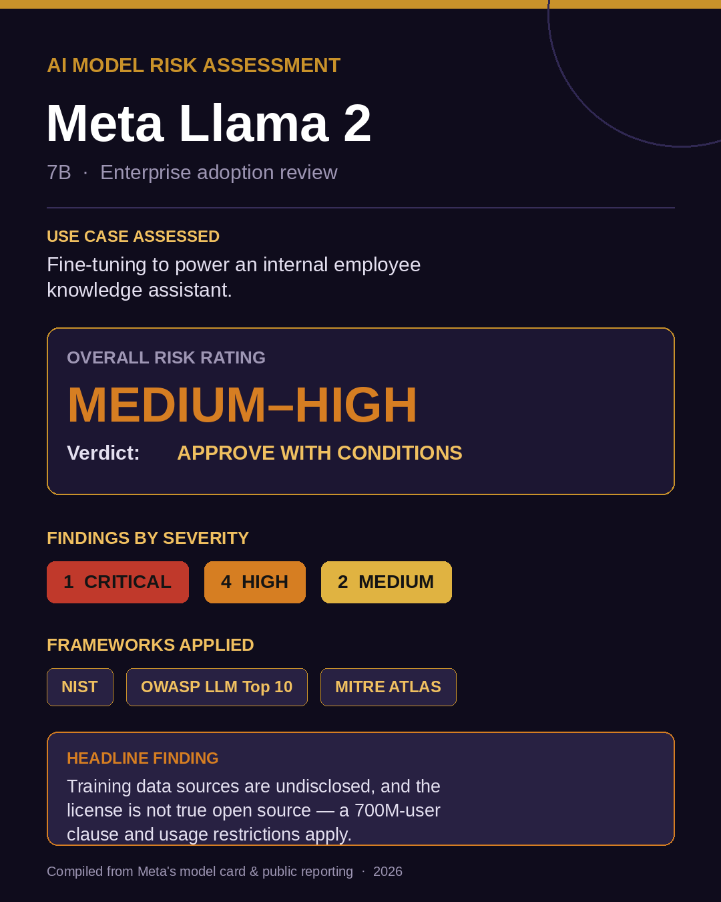
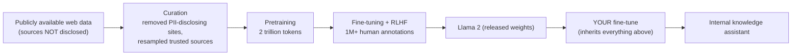
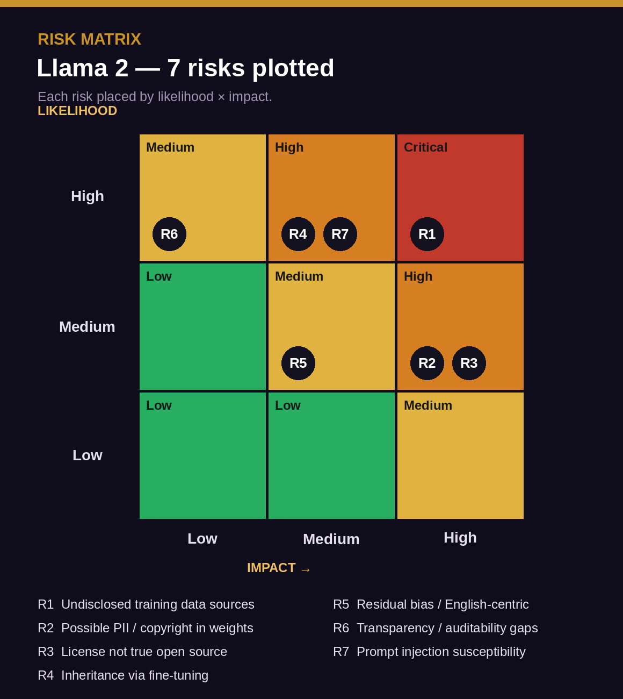
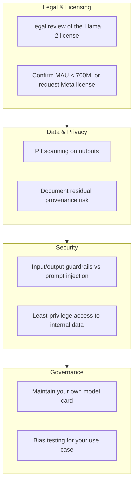

# AI Model Risk Assessment — Meta Llama 2

> An enterprise-style risk assessment of Meta's Llama 2 model, evaluated for a realistic adoption scenario. Covers data provenance, licensing, the inheritance problem, framework mapping, scored risks, and recommended controls — the way a model risk management or AI governance team would assess a model before approving it for production.

  

---

## Executive Summary

This report assesses **Meta Llama 2 (7B)** for a realistic enterprise use case: **fine-tuning the model to power an internal employee knowledge assistant.**

Llama 2 is a capable, widely adopted, openly downloadable model with genuine safety engineering behind it. However, this assessment identifies **7 risks — 1 Critical, 4 High, and 2 Medium** — concentrated in three areas: **undisclosed training data provenance, a license that is not true open source, and the risks an organisation inherits when it fine-tunes the model.**

**Overall risk rating: Medium–High.**
**Verdict: Approve with conditions** — acceptable for internal, non-regulated use by an organisation under 700M monthly active users, *provided* the recommended controls are implemented and the license is reviewed by legal. **Not recommended** for high-stakes or regulated use (healthcare, finance, legal) without significant additional controls.

---

## Contents

1. [Assessment Scope](#assessment-scope)
2. [Methodology](#methodology)
3. [Model Overview](#model-overview)
4. [Data Supply Chain](#data-supply-chain)
5. [Risk Register](#risk-register)
6. [Risk Matrix](#risk-matrix)
7. [Detailed Findings](#detailed-findings)
8. [Existing Controls (Meta-provided)](#existing-controls-meta-provided)
9. [Recommended Controls](#recommended-controls)
10. [Risk Verdict](#risk-verdict)
11. [Frameworks Referenced](#frameworks-referenced)
12. [Sources](#sources)

---

## Assessment Scope

| Field | Detail |
|-------|--------|
| **Model** | Meta Llama 2 (7B parameter variant) |
| **Provider** | Meta |
| **Released** | July 2023 |
| **Hosting** | Hugging Face — `meta-llama/Llama-2-7b` |
| **Use case assessed** | Fine-tune to power an internal employee knowledge assistant |
| **Assessing for** | A mid-size enterprise (under 700M MAU), non-regulated internal use |
| **Out of scope** | Public-facing deployment, regulated data, model internals/weights inspection |

---

## Methodology

This assessment follows a standard seven-step model risk workflow: **scope → map the data supply chain → identify risks across categories → score each risk (likelihood × impact) → record in a risk register → recommend controls → issue a verdict.** Risks were evaluated against eight categories (provenance, embedded sensitive data, bias, inheritance, transparency, security, licensing, operational) and mapped to recognised frameworks (NIST, OWASP LLM Top 10, MITRE ATLAS).

> **Scoring note:** Likelihood and impact are each rated Low / Medium / High. The risk level is read off a standard 3×3 matrix, where High likelihood × High impact = Critical.

---

## Model Overview

| Attribute | Detail |
|-----------|--------|
| **Architecture** | Decoder-only transformer (auto-regressive LLM) |
| **Parameters** | 7B (also released in 13B and 70B) |
| **Pretraining data** | 2 trillion tokens from "publicly available sources" — specific sources **not disclosed** |
| **Fine-tuning data** | Public instruction datasets + over 1M human-annotated examples |
| **Meta user data** | Stated **not** included in pretraining or fine-tuning |
| **Data cutoff** | September 2022 (pretraining); tuning data up to July 2023 |
| **Safety work** | RLHF, red-teaming, a Responsible Use Guide, and an Acceptable Use Policy |
| **License** | Llama 2 Community License — **not** OSI-approved open source |

Meta states it curated the pretraining set to remove sites that commonly expose personal data and resampled trusted sources — a genuine, creditable mitigation. The critical gap is that **the actual data sources are never named**, which makes independent provenance auditing impossible.

---

## Data Supply Chain

**The provenance problem:** everything downstream of step A inherits whatever was in the original data — but because the sources are undisclosed, no adopter can fully verify what that is. Meta's curation reduces the risk; it does not eliminate it or make it auditable.

---

## Risk Register

| ID | Risk | Category | Likelihood | Impact | Level |
|----|------|----------|:----------:|:------:|:-----:|
| **R1** | Training data sources are undisclosed — only "publicly available" is stated | Provenance | High | High | 🔴 Critical |
| **R2** | Possible PII or copyrighted content memorised from web-scale data | Embedded Data | Medium | High | 🟠 High |
| **R3** | License is not true open source (700M-MAU clause + Acceptable Use Policy) | Licensing / Legal | Medium | High | 🟠 High |
| **R4** | Fine-tuning inherits all undisclosed data risks and license terms | Inheritance | High | Medium | 🟠 High |
| **R5** | Residual bias and English-centric performance | Bias / Fairness | Medium | Medium | 🟡 Medium |
| **R6** | Transparency gaps limit full auditability | Transparency | High | Low | 🟡 Medium |
| **R7** | Susceptible to prompt injection and jailbreaks | Security | High | Medium | 🟠 High |

---

## Risk Matrix

  

The cluster in the upper-right confirms where attention belongs: **provenance (R1), embedded data (R2), licensing (R3), and inheritance (R4)** are the risks that should drive the adoption decision.

---

## Detailed Findings

### 🔴 R1 — Undisclosed training data provenance *(Critical)*
Meta states Llama 2 was trained on 2 trillion tokens of "publicly available sources" but **does not name those sources**. Earlier Llama 1 documentation listed sources and token counts; Llama 2 dropped that detail. Without provenance, an adopter cannot verify whether the data contained personal data, copyrighted works, or low-quality/biased content. This is the root finding from which several others flow.

### 🟠 R2 — Possible PII / copyrighted content in weights *(High)*
Web-scale training data is known to contain personal information and copyrighted text, some of which models can memorise and reproduce. Meta's curation (removing PII-disclosing sites) reduces this but cannot be independently confirmed because of R1.

### 🟠 R3 — Licensing is not true open source *(High)*
Llama 2 is distributed under the **Llama 2 Community License**, which the Open Source Initiative does **not** recognise as open source. Two clauses matter: (1) organisations exceeding **700 million monthly active users** must request a separate license from Meta, and (2) an **Acceptable Use Policy** restricts certain uses. For most enterprises this is manageable — but it is a contractual landmine if assumed to be "free and open." Requires legal review.

### 🟠 R4 — The inheritance problem *(High)*
Fine-tuning Llama 2 does not reset its risks — it **inherits** all of them: the undisclosed data, any memorised content, the license terms, and the baseline biases. Whatever is wrong with the base model becomes the adopter's problem too.

### 🟠 R7 — Prompt injection susceptibility *(High)*
Like all current LLMs, Llama 2 is vulnerable to prompt injection and jailbreaking — the same class of attack behind the Bing Chat "Sydney" incident. An internal assistant fed untrusted documents is exposed to indirect prompt injection. (See OWASP LLM01.)

### 🟡 R5 / R6 — Bias and transparency *(Medium)*
Meta published bias evaluations and a Responsible Use Guide, but residual bias and English-centric performance remain, and the provenance opacity caps how fully the model can be audited.

---

## Existing Controls (Meta-provided)

A fair assessment credits what the provider already does. Meta ships Llama 2 with real safety engineering:

- **Data curation** — removed websites known to expose personal data; resampled trusted sources
- **RLHF** — reinforcement learning from human feedback to steer toward safer responses
- **Red-teaming** — adversarial testing before release
- **Responsible Use Guide** and **Acceptable Use Policy**
- **Published model card** with benchmarks and limitations

These meaningfully reduce — but do not eliminate — the risks above.

---

## Recommended Controls

Controls the **adopter** must add before deploying the fine-tuned assistant:

| Control | Addresses |
|---------|-----------|
| Legal review of the license before any commercial use | R3 |
| Confirm you are under 700M MAU (or request Meta's license) | R3 |
| Output filtering + PII scanning | R1, R2 |
| Input/output guardrails against prompt injection | R7 |
| Least-privilege access for the assistant's data sources | R7 |
| Bias testing on your specific domain | R5 |
| Maintain your own model card documenting residual risk | R1, R6 |
| Restrict to internal, non-regulated use | All |

---

## Risk Verdict

> ### ✅ Approve with Conditions
>
> Llama 2 (7B) is **acceptable for internal, non-regulated use** — fine-tuned for an employee knowledge assistant — **provided that:**
>
> 1. Legal reviews and signs off on the Llama 2 Community License
> 2. The organisation confirms it is under 700M MAU
> 3. Prompt-injection guardrails and PII output scanning are in place
> 4. Access is least-privilege and the deployment stays internal
> 5. A model card documenting residual risk is maintained
>
> **Do not** deploy for public-facing, high-stakes, or regulated use cases without a significantly expanded control set and a fresh assessment.

The Medium–High rating reflects a capable model with real safety work, held back from a clean approval by genuine, unavoidable provenance and licensing gaps.

---

## Frameworks Referenced

- **NIST** adversarial ML attack families (Evasion, Poisoning, Privacy, Abuse)
- **OWASP Top 10 for LLM Applications (2025)** — notably LLM01 (Prompt Injection), LLM02 (Sensitive Information Disclosure), LLM03 (Supply Chain), LLM04 (Data & Model Poisoning)
- **MITRE ATLAS** — Adversarial Threat Landscape for Artificial-Intelligence Systems
- **Stanford Foundation Model Transparency Index** — context for provenance-disclosure gaps

---

## Sources

1. Meta — *Llama 2 model card* (training data, license, safety) — huggingface.co/meta-llama/Llama-2-7b
2. Meta — *Llama 2 Community License & Acceptable Use Policy*
3. Open Source Initiative — commentary that the Llama license is not OSI open source
4. OWASP — *Top 10 for LLM Applications (2025)* — genai.owasp.org
5. MITRE ATLAS — atlas.mitre.org
6. Stanford CRFM — *Foundation Model Transparency Index*

---

Independent model risk assessment compiled from public documentation for educational and portfolio purposes · 2026

